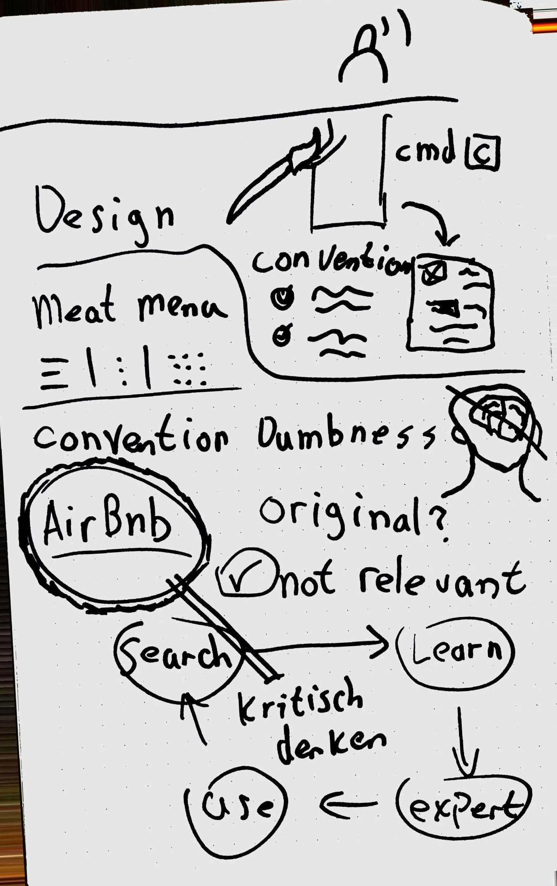
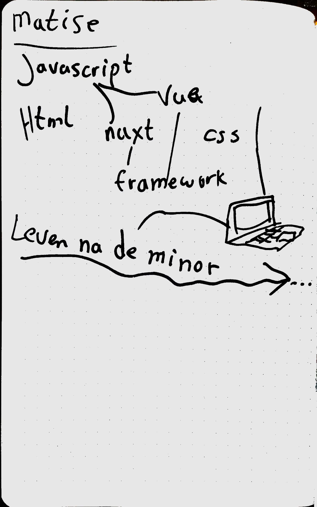
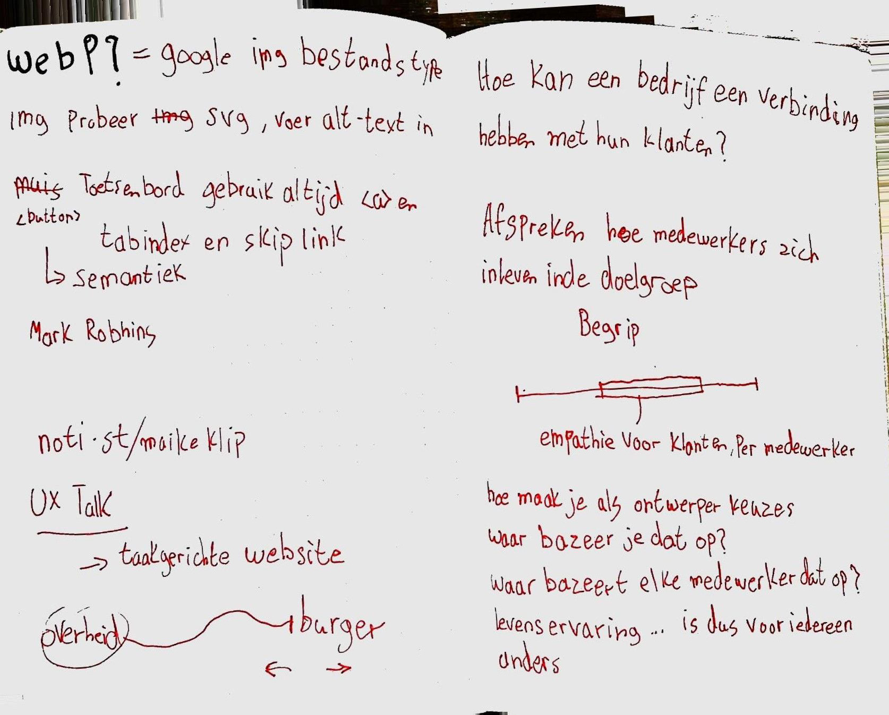
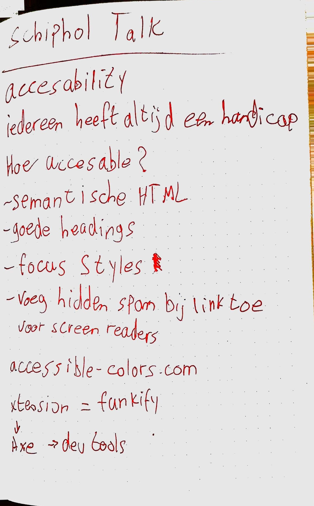

# Weekly Nerd 🤓 / Weekly Mingle 👪

## Overview

## Weekly Nerd - Maaike van Cruchten en Brit Wijnmaalen
Maaike and Brit gave a talk about how and why to 'sketchnote'. The visual aspect helps you remember things better. It also really helps with your drawing skills! Being able to express yourself in drawing can always come in handy, since an image can tell more than a tousand words. 

    
Sketchnotes

## Weekly Nerd - Stephan Hay
Stephan Hay talked about why designers should not always just do what others do, because it 'works'. He took a closer look into how and why we use design patterns. And how we should user them. 

    
Sketchnotes

## Weekly Nerd - Cyd Stumpel en Dennis Spierenburg
This weekly nerd Cyd en Dennis talked about life after the minor and how they ended up at Matise. They talked a lot about the developers at Matise and how they operate. 

    
Sketchnotes

## Weekly Nerd - Maike Klip
Maike works for DUO and showed how she did user research. She proved that a UX-designing isn't just about the user but also the company's attitude towards the users. 

    
Sketchnotes

## Weekly Nerd - Ischa Gast @Schiphol
This talk at schiphol was mainly focused on accesebility and how they try to improve the accesebility on their products, such as the schiphol website. Also a blind person spoke about how he uses the web, which was a real eye-opener to see. 

    
Sketchnotes

## Weekly Nerd - Workshop De Voorhoede
This week we visited De Voorhoede in Amsterdam, who specialise in Front-end Development. The workshop was about progressive enhancement. Which basically means that the core functionallity will work on (almost) all devices. We had to progressive enhance a collor-picker, and discovered that there is actually an `<input type="color">`.

## Weekly Mingle - ICATT
ICATT is a digital agency, like almost every company participating in the weekly mingle. They told us what sort of clients they have, how they work and what a potential intern would be doing. At the end we had to give a personal pitch, to practice applying for jobs in the future. The way this company held this weekly mingle was quite creative compared to the other companies, which is a big plus. 

Personally I didn't quite feel the match between me and ICATT, but that's just an impression from one hour. 

## Weekly Mingle - Lifely
Lifely gave a very cosy nerdy impression, which is something very positive in my opinion! They were a bunch of nerds playing Super Smash Bros on the switch which I can very much relate to! So the company culture was definetly a match in my opinion. 

The code standard at Lifely is at a high level, which is much better than a company where every developer just writes code however they like. 

## Weekly Mingle - Dept
Dept is a very big company with locations all over the world. The entire floor was made of concrete, because the CEO could skateboard more easily this way. I think this summarizes the company culture very well. 

Dept has very big projects with clients all over the world. They organize a yearly Dept Festival, where people are being flown in from all over the world. Afterwards they hire an entire holiday resort just for their employees. And yeah they've also got a beer tap in the middle of the office 😍

So in my opnion Dept is a very cool company!

## Weekly Mingle - Elastique
*Unfortunally I couldn't attend the weekly-mingle at Elastique*

## Weekly Mingle - Valtech
Valtech is also a very big company with locations all over the world. To be honest all companies sort of did the same thing. They all work with Vue.js of React.js and organize their workflow by working with Scrum. The things that set them apart are: the company culture, the brand and core values, how much time there was for an employee to learn something new.

The employee who gave the presentation at the weekly mingle was very much up to date with the latest technologies. At most companies we where the ones telling them new things we learned in the minor, but at Valtech they were teaching us things we hadn't even heard of during the minor. Like: Web-components and Polymer. 

## Weekly Mingle - Mirabeau
*I couldn't attend this weekly mingle because I was in Edinburgh for the Wallscope project*

## Weekly Mingle - Q42
This is one of my favorite companies of the weekly mingle. To me this company is just a big playground for developers, at least that's what it looked like from the presentation. Every week the employees get 2 hours to spent on research of new technologies so they keep up to date. 

Q42 is defenitly a company that differs from the 'pack'(Digital agencies). When a client approaches them with an idea or a problem that has to be solved. Q42 will first look wether the problem is really a problem and if the idea is really the solution. This is something which I think is really cool. They showed that because of this approach to clients their products aren't just a standard website of dashboard. For example some products involve VR or IOT. This is not common for a digital agency, at least from what I have seen. 

Overal a very interesting company!

## Weekly Mingle - Matise
Matise has an interesting location. They're in a typical Amsterdam house with the zoo Artis right in front of them. 
They showed us around and explained what clients they work for. A particular client already had a design and just wanted matise to build it. But Matise took a closer look into the case and found that the design was very generic and didn't show anything about what the company is. 

So they redesigned it into something that really fits the brand the client wanted to show to the world. I think this is a typical CMD assignment. Where a client wants something, the CMD student does some research and then convinces the client that what they want isn't what they need. So it's a very good mindset to have as a company apposed to clients. 